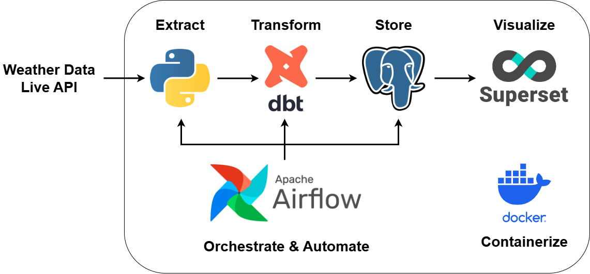
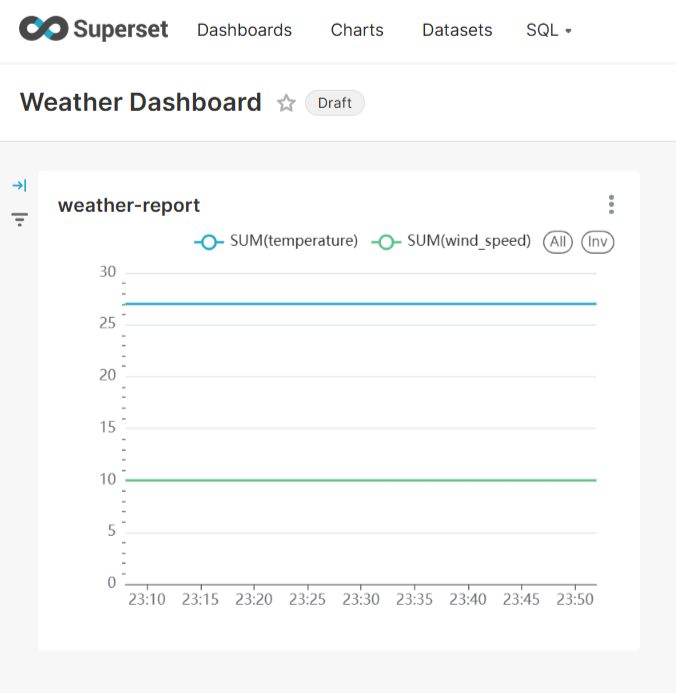

# 🌤️ Weather Data Pipeline Dashboard



This project is a containerized data pipeline for collecting, transforming, storing, and visualizing weather data. It uses Airflow for orchestration, DBT for transformation, PostgreSQL for storage, and Superset for visualization. The weather data is collected from [weatherstack](https://weatherstack.com/).

---

## 🔧 Tech Stack

- **Airflow** – Workflow orchestration
- **DBT** – Data transformation
- **PostgreSQL** – Data storage
- **Apache Superset** – Dashboard & visualization
- **Docker** – Containerization

---

## 📁 Project Structure

```bash
.
├── .venv/                  # Python virtual environment (ignored)
├── airflow/                # Airflow dags and configs
│   └── dags/
│       └── orchestrator.py
├── api-request/            # Scripts to fetch and insert weather data
│   ├── api_request.py
│   └── insert_records.py
├── dbt/                    # DBT project and logs
│   └── my_project/
│       └── models/
├── docker/                 # Docker configuration files
│   ├── .env                # Environment variables (not committed)
│   ├── docker-init.sh
│   ├── docker-bootstrap.sh
│   └── superset_config.py
├── postgres/               # Database init scripts and volume mount
│   ├── airflow_init.sql
│   └── superset_init.sql
├── docker-compose.yaml     # Compose setup for the entire project

```

## 🚀 Getting Started

### 1. Clone the repository

```bash
git clone https://github.com/yourusername/weather-data.git 
cd weather-data
```

### 2. Start the services

```bash
docker-compose up --build
```

This will spin up:
-   Airflow Webserver & Scheduler
-   PostgreSQL
-   Superset
-   Your custom data fetch scripts (via Airflow DAGs)

---

## 🌀 Workflow Overview

1.  **Fetch weather data** via API (`api_request.py`)
2.  **Insert raw data** into PostgreSQL (`insert_records.py`)
3.  **Orchestrate the process** using Airflow (`orchestrator.py`)
4.  **Transform the data** using DBT
5.  **Visualize** in Superset dashboard

---

## 🗂️ Airflow UI

You can monitor and trigger DAGs at:

```bash
http://localhost:8080
```

---

## 📊 Superset Dashboard

Once everything is up, you can access Superset at:

```bash
http://localhost:8088
```

Default login:
-   **Username**: admin
-   **Password**: admin

### Preview



